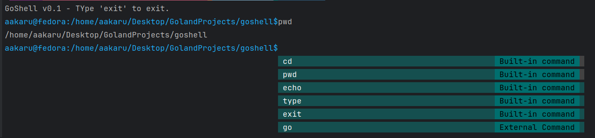

#  GoShell

A lightweight interactive shell written in Go! 🚀

## ✨ Features

-  Fast and lightweight command execution
-  Smart tab completion for commands and files
-  Built-in commands (`cd`, `pwd`, `echo`, `type`, `exit`)
-  External command execution
- Beautiful interactive prompt




## 📁 Project Structure

```
goshell/
├── main.go        # Entry point and initialization
├── executor.go    # Command execution engine
├── completion.go  # Tab completion implementation
├── builtins.go    # Built-in command implementations
└── utils.go       # Utility functions
```

## 🔧 Installation

### Prerequisites

-  Go 1.16 or higher
-  Git

```bash
# Clone the repository
git clone https://github.com/yourusername/goshell.git

# Navigate to the project
cd goshell

# Install dependencies
go mod tidy

# Build the project
go build
```

## 🚀 Usage

Run the shell with:

```bash
./goshell
```

### 📝 Built-in Commands

| Command | Description | Usage |
|---------|-------------|-------|
| `cd` | Change directory | `cd [directory]` |
| `pwd` |  Print working directory | `pwd` |
| `echo` |  Echo text to standard output | `echo [text]` |
| `type` |  Display command type | `type [command]` |
| `whoami` |  Display user | `whoami` |
| `exit` |  Exit the shell | `exit [code]` |

## 🛠️ Development

### Building from Source

```bash
go build -o goshell
```

### Dependencies

- [github.com/c-bata/go-prompt](https://github.com/c-bata/go-prompt) - Interactive prompt library

## 🤝 Contributing


Contributions are welcome! Feel free to submit issues or pull requests.

1. Fork the repository
2. Create your feature branch: `git checkout -b feature-name`
3. Commit your changes: `git commit -m 'Add some feature'`
4. Push to the branch: `git push origin feature-name`
5. Submit a pull request

## 📝 License

This project is licensed under the MIT License - see the [LICENSE](LICENSE) file for details.

